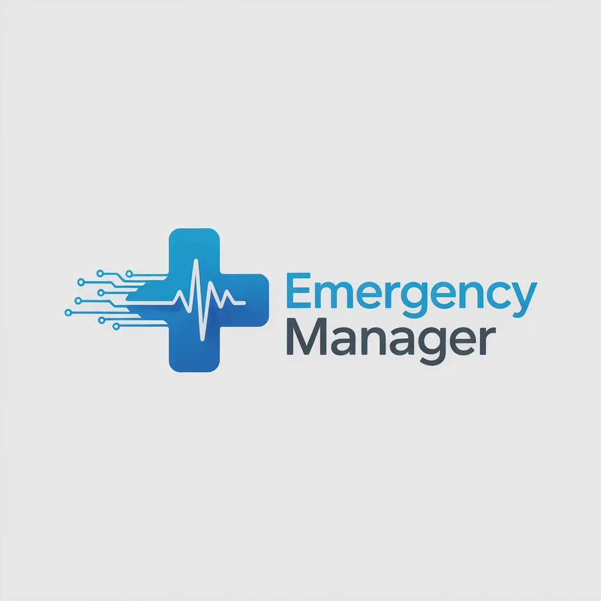

# Emergency Manager

## Sobre o Projeto

O **Emergency Manager** é um sistema desenvolvido para ajudar empresas privadas de primeiros socorros a gerenciar suas operações de forma organizada e eficiente.

A plataforma permite o controle de frotas (UTI móvel, ambulâncias, veículos 4x4), gestão de funcionários e escalas, cobertura de eventos, cadastro de clientes e acompanhamento de atendimentos — tudo em um único sistema.

O objetivo é centralizar informações, reduzir falhas operacionais e oferecer mais controle e visão estratégica para gestores do setor de emergência.